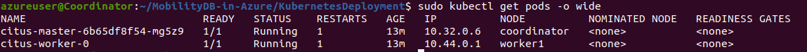

# MobilityDB-in-Azure

## Execution Guidelines

The purpose of this section is to enable the user reuse the existing work.

### Required Components
This work combines different tools and technologies to create a self-managed database on the cloud. The following list include the required components along with some links that assist the users install and configure them.

* A local computer running **Linux OS** (tested with Ubuntu 20.04).
* A **Microsoft Azure account** with an active subscription attached to it. The user must have full access to the Azure resources (Owner).
* A Service Principal, created and configured for your Azure account. More details on how to create a Service Principal can be found [here](https://docs.microsoft.com/en-us/azure/developer/python/configure-local-development-environment?tabs=cmd#required-components).

### Cluster Initialization
To deploy a MobilityDB cluster on Azure, follow the below steps:
<ol>
<li>Clone the Github repository</li>
<li>Configure the bash script under the path <strong>MobilityDB-in-Azure/automaticClusterDeployment/KubernetesCluster/deployK8SCluster.sh</strong>, by modifying the values of the parameters placed on the top of the file in the following way:
    <ul>
    <li><code>AzureUsername</code> parameter is used to login to your Azure account.</li>
    <li>The default <code>ResourceGroupName</code>, <code>Location</code> and <code>VirtualNetwork</code> values can be used.</li>
    <li><code>Subscription</code> defines the name of the active Azure subscription.</li>
    <li><code>VMsNumber</code> determines the number of Worker nodes and <code>VMsSize</code> the size of each machine.</li>
    <li><code>SSHPublicKeyPath</code> and <code>SSHPrivateKeyPath</code> values specify the location of the ssh private and public keys to access the created VMs. By default, the files will be stored in <strong>~/.ssh/</strong> directory.</li>
    <li><code>Gitrepo</code> specifies the Github repository from which the installation scripts and the rest source files will be found.</li>
    <li><code>Service_app_url</code> determines  the  url  of  the  Service  Principal  and <code>Service_tenant</code> the tenant’s id. When executing the script, the <code>Client secret</code> should be given by the user to authenticate the application in Azure.</li>
    </ul>
</li>
<li>Execute the script by running <code>bash MobilityDB-in-Azure/automaticClusterDeployment/KubernetesCluster/deployK8SCluster.sh</code>. After some few minutes, the cluster will be deployed on Azure.</li>
</ol>

When the cluster is ready, you can access any machine using the `~/.ssh/id_rsa` key. The next step is to establish an ssh connection with the Coordinator VM. To connect to the machine, run `ssh -i ~/.ssh/id_rsa azureuser@{vm_ip_address}`, where vm_ip_address is the public ip address of the Coordinator VM that can be found inAzure portal. When connected to the VM, you can confirm that the K8S cluster has been successfully initialized by executing `sudo kubectl get nodes`.

### Deploying A PostgreSQL Cluster

Until now we have created a Kubernetes cluster on Azure. The purpose of this section is to deploy a PostgreSQL cluster with Citus and MobilityDB extensions installed. First we need to modify the provided configuration files:
<ol>
<li>Edit the content of <strong>MobilityDB-in-Azure/KubernetesDeployment/postgres-secrets-params.yaml</strong> file by changing the values of the <strong>username</strong> and <strong>password</strong>. These credentials will be the default keys to access the PostgreSQL server.  The values should be provided as base64-encoded strings. To get such an encoding, you can use the following shell command: <code>echo -n "postgres" | base64</code>.</li>
<li>Replace the content of the folder <strong>MobilityDB-in-Azure/KubernetesDeployment/secrets</strong> by creating your own SSL certificate that Citus will use to encrypt the database data.</li>
<li>Edit the content of <strong>MobilityDB-in-Azure/KubernetesDeployment/postgres-deployment-workers.yaml</strong> by setting the replicas to be equal to the number of available worker machines that you want to create.</li>
<li>Run <code> bash MobilityDB-in-Azure/KubernetesDeployment/scripts/startK8s.sh</code> to create the Kubernetes deployment. After some few minutes, the Pods will be created and ready to serve the database.</li>
</ol>

Now you are ready to connect to your distributed PostgreSQL cluster. After connecting to the Coordinator VM, execute the following shell command to ensure that the Pods are running, as show in the following screenshot : `sudo kubectl get pods -o wide`. Normally, you should see one Pod hosting the citus-master and a number of citus-worker Pods, equal to the replica number that you defined before.  

You can connect to the Citus Coordinator by using the **public ip** of the master VM as **host name/address**, **30001 as port**, **postgres as database** and the **username** and **password** that you defined before. The default values are **postgresadmin** and **admin1234**, respectively. Try to execute some Citus or MobilityDB queries. For instance, run `select master_get_active_worker_nodes()` to view the available Citus worker nodes.

### Self-managed PostgreSQL Cluster

Assuming we have successfully done all the previous step, we are now ready to turn the PostgreSQL database into a self-managed cluster. The process of monitoring and applying an auto-scaling mechanism is managed by a script, implemented as a Daemon process and written in Python 3. To execute the script, follow the step below:

<ol>
<li>Replace   the   parameters   on   the top of the <strong>MobilityDB-in-Azure/autoscaling/scripts/addNewVms.sh </strong> file with the same parameters that you provided in <strong>MobilityDB-in-Azure/automaticClusterDeployment/KubernetesCluster/deployK8SCluster.sh</strong>.</li>
<li>Execute <code>sudo -s</code> command on the Coordinator VM to get root access rights.</li>
<li>Create a virtual environment by running <code>python3 -m venv venv</code> and activate it <code>source venv/bin/activate</code></li>
<li>Install the required packages by first running <code>pip install setuptools-rust</code>, <code>export CRYPTOGRAPHY_DONT_BUILD_RUST=1</code> and <code>pip install -r MobilityDB-in-Azure/autoscaling/requirements.txt</code>.</li>
<li>Export the following environment variables, by adjusting their values as follows:</li>
    <ul>
    <li><code>export AZURE_SUBSCRIPTION_ID=...</code>, <code>export AZURE_TENANT_ID=...</code>, <code>export   AZURE_CLIENT_ID=...</code> and <code>export AZURE_CLIENT_SECRET=...</code> by specifying the corresponding values from the Azure Service Principal.</li>
    <li><code>export RESOURCE_GROUP=...</code> with the Azure resource group name.</li>
    <li><code>export POSTGREDB=postgres</code>, <code>export POSTGREUSER=...</code> and <code>export POSTGREPASSWORD=...</code> with the corresponding server credentials.</li>
    <li><code>export POSTGREPORT=30001</code>.</li>
    <li><code>export SCRIPTPATH=/home/azureuser/MobilityDB-in-Azure/autoscaling/scripts</code>, assuming you have cloned the source code into /home/azureuser path.</li>
    </ul>
<li>Finally, execute the following command to launch the auto-scaler: <code>python3 AutoscalingDaemon.py –action start –minvm 2 –maxvm 8 –storage /home-/azureuser/autolog –lower_th 70 –upper_th 30 –metric sessions</code>. You can get more information regarding the available parameters by running <code>python3 AutoscalingDaemon.py --help</code>. <strong>Note:</strong> the auto-scaler is a Daemon process hence, the script can be executed in the background. Information about the state of the auto-scaler can be found in <strong>/var/log/autoscaling.log</strong> and <strong>/var/log/autoscaling_performance.log</strong> log files.</li>
</ol>
